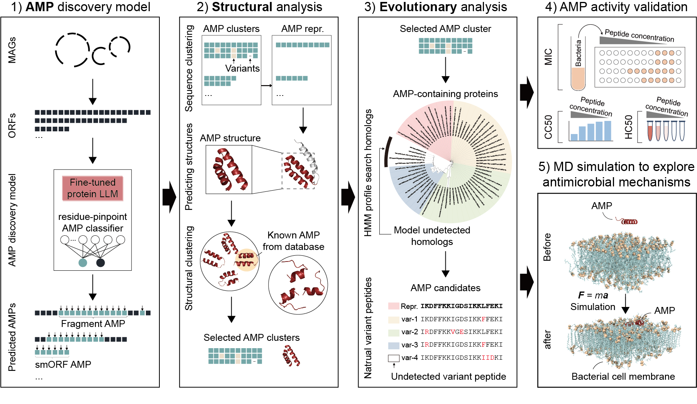

# AMP-SEMiner: <u>A</u>nti<u>M</u>icrobial <u>P</u>eptide <u>S</u>tructural <u>E</u>volution <u>M</u>iner

## Introduction

This repository contains the custom code for **AMP-SEMiner**, a robust and comprehensive AI framework designed for residue-level AMP discovery. The framework accurately identifies specific residues within a protein as either AMP or non-AMP.

## Environment
AMP-SEMiner is run on Python 3.10 and PyTorch 2.1.2. You can build a conda environment for AMP-SEMiner using this [script](https://github.com/zjlab-BioGene/AMP-SEMiner/blob/main/scripts/env_install.sh).

## Run AMP prediction

The model weights of AMP-SEMiner and minimum datasets to run AMP-SEMiner are available in [Zenodo](https://zenodo.org/records/14348290) (DOI: 10.5281/zenodo.14348290). A small example dataset are also provided:

[Tok_CLS.tar.gz](https://zenodo.org/records/14348290/files/Tok_CLS.tar.gz)

[Tok_CLS_LoRA.tar.gz](https://zenodo.org/records/14348290/files/Tok_CLS_LoRA.tar.gz)

[2_steps.tar.gz](https://zenodo.org/records/14348290/files/2_steps.tar.gz)

[example_dataset.tar.gz](https://zenodo.org/records/14348290/files/example_dataset.tar.gz)

<pre>
mkdir model_weights
cd model_weights

## download model weights
wget https://zenodo.org/records/14348290/files/Tok_CLS.tar.gz
tar -zxvf Tok_CLS.tar.gz

wget https://zenodo.org/records/14348290/files/Tok_CLS_LoRA.tar.gz
tar -zxvf Tok_CLS_LoRA.tar.gz

cd -

## download example datasets
wget https://zenodo.org/records/14348290/files/example_dataset.tar.gz
tar -zxvf example_dataset.tar.gz
</pre>

<pre>
mkdir example_out

#conda activate ampseminer
python End_to_end_Tok_CLS/pred_Token.py \
    --input example_dataset/test_dataset.csv \
    --output example_out/test.out_pred.tsv \
    --model_name model_weights/Tok_CLS/epoch15 \
    --batch_size 4 \
    --max_len 300
</pre>

## Run training

Example datasets for AMP model trainining:

[example_data.tar.gz](https://zenodo.org/records/14348290/files/example_data.tar.gz)

[example_labels.tar.gz](https://zenodo.org/records/14348290/files/example_labels.tar.gz)

<pre>
## download example datasets for AMP model training

wget https://zenodo.org/records/14348290/files/example_data.tar.gz
tar -zxvf example_data.tar.gz

wget https://zenodo.org/records/14348290/files/example_labels.tar.gz
tar -zxvf example_labels.tar.gz

#conda activate ampseminer
python End_to_end_Tok_CLS/train_Tokens.py \
    --data_path ./example_data \
    --label_path ./example_labels \
    --model_name facebook/esm2_t30_150M_UR50D \
    --num_classes 2 \
    --ft_mode full \
    --epochs 10 \
    --batch_size 16 \
</pre>

## Custom code for Colab Notebook

Install and run our AMP discovery model [run_pred_AMP_SEMiner.ipynb](https://colab.research.google.com/drive/1-O8U7M6UTtSaMQqm3sX7ZOtkUCVEmmLt?usp=sharing)

## Datasource

| DataBase | DataSet | Download URL |
| - | - | - |
| MGnify | mgnify_human_gut mgnify_human_oral mgnify_cow_rumen mgnify_pig_gut mgnify_fish_gut mgnify_zibrafish_fecal mgnify_marine | https://www.ebi.ac.uk/metagenomics/browse/genomes |
| CGMR | Chinese Gut Microbial Reference | https://ngdc.cncb.ac.cn/bioproject/browse/PRJCA017330 |
| Hadza | Metagenomics dataset | https://doi.org/10.1016/j.cell.2023.05.046 |
| Ancient-human-gut | Metagenomics dataset | https://www.nature.com/articles/s41586-021-03532-0 |
| BGI_human_oral | 4D-SZ cohort | https://db.cngb.org/search/project/CNP0000687 |
| glacier | Glacier Microbiomes | https://www.biosino.org/node/project/detail/OEP003083 |

## Citation

## Contacts

zhengjinfang1220@gmail.com, liwh@zhejianglab.org, liwh@tongji.edu.cn